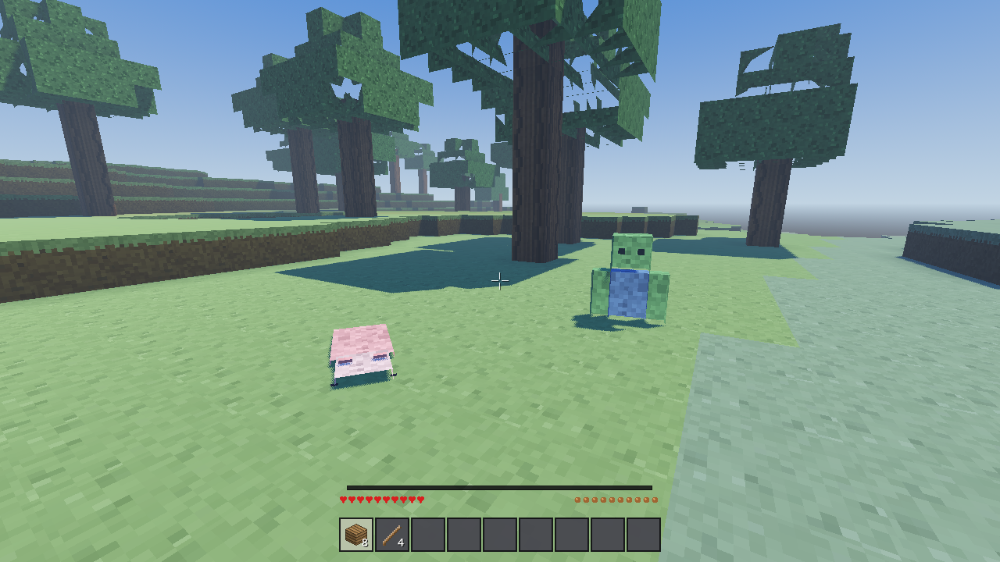
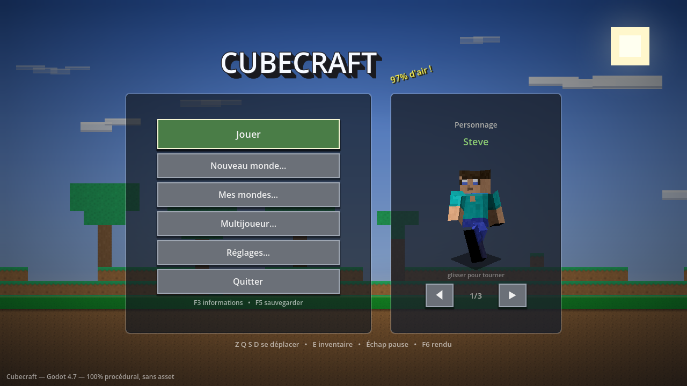
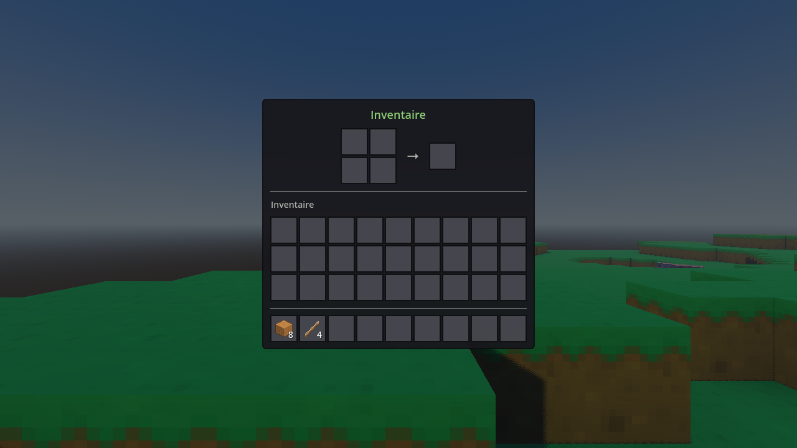
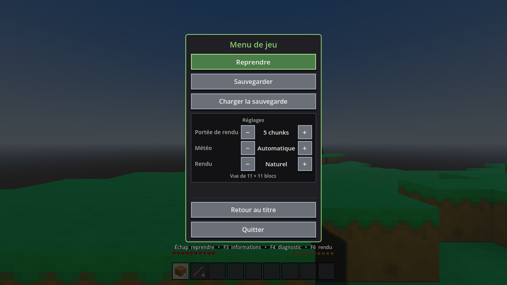

<p align="center">
  <a href="docs/screenshots/vue.png">
    
  </a>
</p>

<h1 align="center">Cubecraft</h1>

<p align="center">
  
  &nbsp;
  
  &nbsp;
  
  &nbsp;
  
  &nbsp;
  
</p>

Un bac à sable en voxel, écrit en GDScript pour **Godot 4.7**, et
**entièrement procédural** : les textures, les sons, le terrain, les arbres et
les grottes sont tous calculés par le code au démarrage. Le dépôt ne contient
**aucune image** — tout ce que vous voyez est peint par le programme avant la
première image affichée.

## Captures

Les images viennent du jeu lui-même : chacune est produite par un mode de
capture en ligne de commande, jamais dessinée à la main. Elles se régénèrent
avec `godot --fpshot`, `godot --pauseshot` et `godot --titletest`, et vivent
dans [`docs/screenshots/`](docs/screenshots/).

<table>
  <tr>
    <td align="center" valign="top">
      <a href="docs/screenshots/titre.png">
        
      </a>
      <br><sub><b>Écran titre</b> — ciel, logo et aperçu du personnage</sub>
    </td>
    <td align="center" valign="top">
      <a href="docs/screenshots/inventaire.png">
        
      </a>
      <br><sub><b>Inventaire</b> — 36 places, fabrication 2×2</sub>
    </td>
    <td align="center" valign="top">
      <a href="docs/screenshots/pause.png">
        
      </a>
      <br><sub><b>Menu pause</b> — sauvegarde, rendu, météo</sub>
    </td>
  </tr>
</table>

## Au programme

- **Terrain infini** en chunks, avec biomes, grottes, minerais et groviers
- **Cycle de minage** à quatre paliers : mains nues, puis bois, pierre, fer,
  diamant — chaque minerai exige l'outil précédent
- **Survie** : faim, dégâts de chute, blessures, mort et points d'expérience
- **Mobs** : apparition selon l'heure, brûlure au soleil, comportements d'IA
- **Fabrication** 2×2 à la main, 3×3 à l'établi, plus enclumes et fourneaux
- **Enchantements** à la table d'enchantement, sur armure et outil
- **Météo** (pluie, orage, neige) et cycle jour/nuit
- **Multijoueur** ENet jusqu'à huit joueurs
- **Manette** reconnue sans réglage
- **Sauvegardes** en six emplacements, avec index d'en-têtes

## Lancer le jeu

```bash
godot                                  # jouer
godot --seed=1234                      # choisir son monde
godot --load                           # reprendre la sauvegarde
godot --distance=7                     # portee de rendu initiale
godot --shader=1                       # rendu au lancement (1 chaleureux, 2 vif)
```

Il faut [Godot 4.7](https://godotengine.org/download) et rien d'autre : pas de
dépendance à installer, pas d'asset à télécharger. Le premier lancement importe
le projet et génère les textures, ce qui prend quelques secondes.

## Commandes

| Touche | Action |
|---|---|
| `Z Q S D` / `W A S D` / flèches | se déplacer (AZERTY et QWERTY) |
| `Espace` | sauter / monter en vol |
| `Maj` | courir |
| `Ctrl` | s'accroupir / descendre en vol |
| `F` | activer le vol |
| Clic gauche (maintenu) | miner |
| Clic droit | poser un bloc — ouvrir l'établi ou la table d'enchantement si on les vise |
| Clic molette | prendre le bloc visé |
| `1`…`9`, molette | changer d'emplacement |
| `E` | inventaire (fabrication 2×2) |
| `T` ou `/` | chat (ouvre la saisie, la souris est libérée) |
| `G` | jeter l'objet tenu |
| `F3` | informations (FPS, position, biome, chunks) |
| `F4` ou `Ctrl`+`Alt`+`D` | menu de diagnostic |
| `F5` | sauvegarder |
| `F6` | rendu : naturel, chaleureux, vif |
| `Échap` | menu pause |

Les touches sont enregistrées par `InputSetup` au démarrage, avec des
`physical_keycode` : sur un clavier AZERTY, `{Z}` et `{W}` déclenchent « avancer ».
La manette et l'écran de lancement sont détaillés dans
[docs/commandes.md](docs/commandes.md).

## Tests

901 vérifications automatiques, toutes en headless, lancées par la CI à chaque
push :

| Suite | Vérifications |
|---|---|
| `tools/SmokeTest.gd` | 686 |
| `--uitest` | 105 |
| `tools/NetTest.gd` | 67 |
| `tools/CheckContent.gd` | 28 |
| `tools/CheckLights.gd` | 15 |

Deux suites existent encore, lancées à la main : `tools/CheckTitle.gd` (26, le
relief de l'écran titre) et `tools/CheckWorld.gd` (7, le vidage des files de
tâches à la mort du monde) — cette dernière s'arrête sur un `abort` du moteur
en quittant, sa sortie ne peut donc pas être lue par la CI.

```bash
godot --headless --import                            # compile tout le projet
godot --headless --script res://tools/SmokeTest.gd   # 686 verifications
```

Le détail des suites et du menu de diagnostic est dans
[docs/diagnostic.md](docs/diagnostic.md).

## Documentation

Le détail est réparti dans [`docs/`](docs/) plutôt que dans cette page, qui
gardait 770 lignes et devenait illisible :

| Page | Contenu |
|---|---|
| [docs/commandes.md](docs/commandes.md) | Manette, écran de lancement, sauvegardes |
| [docs/jeu.md](docs/jeu.md) | Boucle de jeu, paliers de minage, blocs dangereux, écran titre |
| [docs/architecture.md](docs/architecture.md) | Architecture du code, décisions à connaître, personnage |
| [docs/rendu.md](docs/rendu.md) | Rendu, touche F6, musique, éclairage des torches |
| [docs/multijoueur.md](docs/multijoueur.md) | Multijoueur ENet |
| [docs/diagnostic.md](docs/diagnostic.md) | Menu de diagnostic, suites de tests, options en ligne de commande |
| [docs/limites.md](docs/limites.md) | Limites connues et compromis assumés |

## Un pack d'images facultatif

Le dépôt ne contient aucune image, mais une branche à part,
[`kenney-assets`](https://github.com/DmzGamingYT/Cubecraft/tree/kenney-assets),
ajoute un pack **CC0** de Kenney Vleugels : quelques tuiles et icônes y sont
remplacées par des dessins prêts à l'emploi. Ce n'est pas obligatoire — c'est un
vernis, pas une dépendance. `scripts/gen/ExternalTiles.gd` habille l'atlas
uniquement pour les fichiers présents, et le jeu est identique sans eux.

```bash
git checkout kenney-assets -- assets/kenney/
```

## Licence

Le code, les scènes, et tout ce que le jeu génère à l'exécution sont sous
[MIT](LICENSE) — réutilisation, modification et redistribution libres, y compris
commerciale. Le pack CC0 de la branche `kenney-assets` est hors de cette
licence et reste libre de toute contrainte ; sa licence est dans
`assets/kenney/LICENSE-kenney.txt` sur cette branche.
